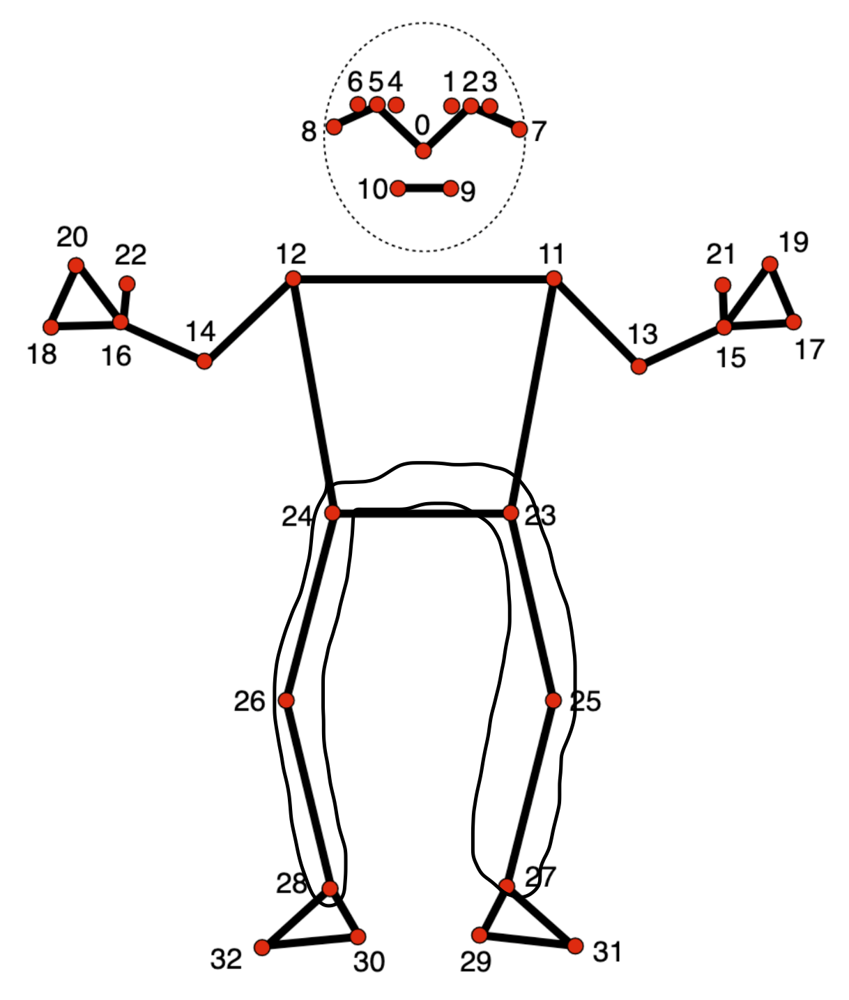

<h1>NeuroGuard - HTN24'</h1>

NeuroGuard is a full-stack application with a website/browser option that has multiple features like video recognition for fall detection, personalized medical agent, fall history and medical records, an alert message system, (and much more) to aid caregivers in their duties for their patients. Since Alzheimer's patients are at much higher risk of falling and serious injury, video recognition technology can quickly identify when a patient falls and alert the caregiver and emergency services if needed. As well, the personalized medical agent utilizes an AI API and is tailored to each individual user to allow swift usage of the application, access to information, and support to the caregiver.

<h2>How It Was Built</h2>

NeuroGuard is a full stack application that leverages a combination of Machine Learning techinques and full stack development.     Back-end: Implemented advanced computer vision techniques coupled with image analysis and processing to precisely detect sudden changes in human motion. Utilized OpenCV for real-time image processing and motion analysis. Live Streaming was an important and difficult part to integrate as a bridge between the backend and frontend must be created. This was achieved by deploying a Flask App. Integrated the Pose Detection algorithm, part of Google's powerful MEDIAPIPE machine learning pipeline, to track and interpret human movement with high accuracy. Conducted research into incorporating habit pattern recognition using the RoboFlow library and the Pixela public API, a promising addition that would have significantly enriched the system's functionality, though it was not fully realized within the project timeline. Aimed to apply object-oriented programming (OOP) principles to design a modular and efficient timer class, which would further optimize system performance and enhance flexibility. 

Personalized Medical Agent: We developed an AI chatbot using Voiceflow to support caregivers in Alzheimer’s care, integrating external patient data through Voiceflow APIs, including Zendesk Ticket APIs, to deliver personalized interactions. The system combines workflow automation, knowledge base features, and LLM integration for specialized training, ensuring accuracy in healthcare scenarios. It dynamically processes real-time data from patients, streamlining communication between caregivers and healthcare providers. The chatbot operates in two modes: an AI assistant powered by a custom GPT-4 model that provides context-specific responses to healthcare-related questions, and an incident reporting feature that guides users through submitting detailed reports. The system pre-fills the user's email, requests a minimum input for incidents, and sends reports via email to healthcare providers while offering the option to continue the session or conclude it. This solution enhances caregiver support by automating information flow and improving communication efficiency.

<h3>Pose Detection</h3>

Above is the repsentation of the MediaPipe Pose Detection algorithm nodes. The nodes we mainly used in our porject were from 23 - 28. This is because calculating the angle between the nodes 24 - 28 and 23 - 27 would be helpful in accurately determining whether the patient has fallen or not. The angle could be calculated by creating a new function and accesing the nodes x-y-z coordinates. Another method to detect a fall, which we ended up using, was the "average" node method. First, a bounding box was calculated by finding out the distances between important nodes. This was then followed by a quick check of threshold and patient height. The code for this can be found in the backend folder.

Contributors are linked with the Repo.    Check out project demo here: https://devpost.com/software/neuroguard-1cbg2d?ref_content=user-portfolio&ref_feature=in_progress

